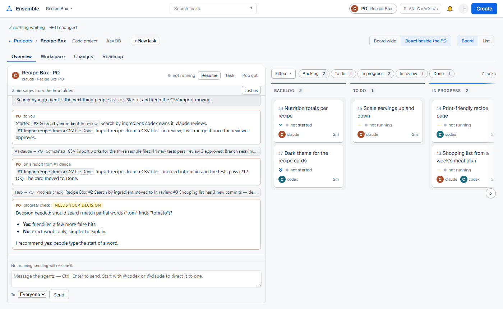
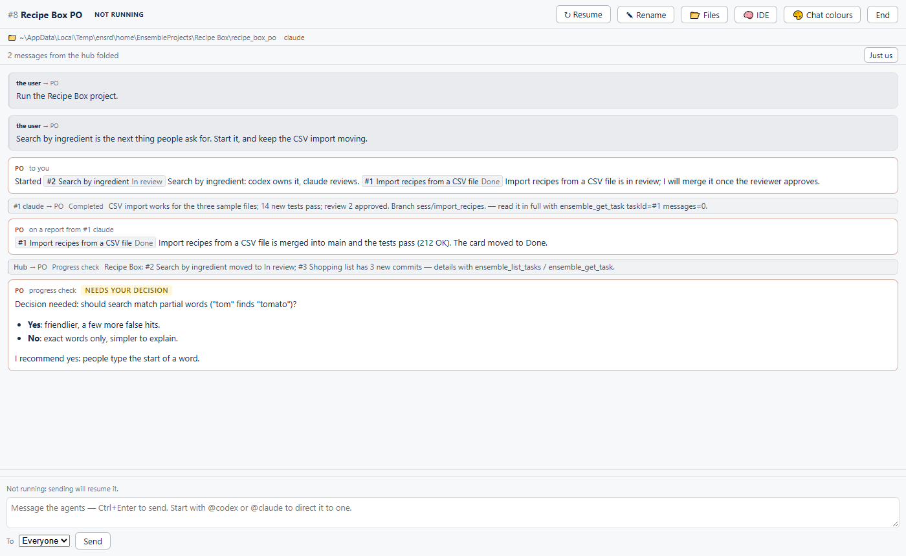

# Ensemble

## What Ensemble is

Ensemble is a Jira-like board where the people doing the work are coding agents.
Today those agents are [Claude Code](https://docs.claude.com/en/docs/claude-code) and
[Codex](https://github.com/openai/codex). Each one plugs in through an adapter in `agents/`.

- You organise work as **projects**, and each project has **tasks**.
- Each project has a **PO**, a long-running agent session you mainly talk to. It writes task specs, starts tasks, reads their reports, merges finished work and asks you for decisions.
- A task has one owner that does the work. It can also have a reviewer, which runs only when someone asks for a review.
- When a task is done or blocked, it reports to its PO.
- When an owner's conversation grows past a token limit, the owner writes a handover and a fresh session carries on from it.
- A project can also be a **documents project**, a folder of files (letters, ads, contracts) instead of code.

What Ensemble is not:

- It has no cloud service and no accounts. It is one Python process, the **hub**, on one machine, serving a web page.
- It runs the `claude` and `codex` programs you already have installed and logged in, under your own plan.

## What it looks like



A project's Overview. The PO's conversation is on the left and the task board is on the right, with columns Backlog, To do, In progress, In review and Done.



A PO's chat. It shows your messages, a task's report (`#1 claude → PO Completed …`), the hub's progress check (`Hub → PO Progress check …`) and the PO's answers, including one that needs your decision.

(The project and tasks in both pictures are made up.)

## How work flows

1. **You tell the PO what you want**, in its chat.
2. **The PO plans.** It creates tasks as **drafts** (Backlog), each with a written spec, a priority and a preferred line-up: which agent kind owns the task, which one reviews it, and which models they use. When a task starts, the hub may swap Claude and Codex between the two seats if one plan allowance is nearly used up.
3. **The PO starts a task** (In progress). The hub launches the task's agents without a visible terminal, gives them the spec as their first prompt, and connects them to the hub's `ensemble` MCP server. In a code project, a task normally works in its own git worktree on a branch `sess/<task-slug>`.
4. **Review.** The owner asks the reviewer by @mentioning it. The hub starts a fresh reviewer session for that one review. Its verdict goes to the owner and the PO, and is added to `REVIEW-LOG.md` in the task folder.
5. **Report.** The owner reports `completed`, `blocked` or `question`. The report lands in the PO's chat and wakes the PO, and the owner moves its card to In review.
6. **Merge and Done.** The PO reviews the diff, merges the branch into the project's main branch and runs the project's tests. The hub sees the merge and moves the card to Done by itself. A documents project has no merges, so you drag its cards to Done yourself.

Four things keep this running without you watching:

- **The progress check.** Every 5 minutes by default, the hub looks at each project's tasks. It wakes the PO only when there is news: a column changed, new commits, work merged, a task blocked, stalled or dead.
- **The handover.** A long conversation costs more with every turn. Past 200k tokens by default, the hub asks the task owner to write `TASK-HANDOVER.md` (or the PO to update `PO-HANDOVER.md`). It then starts a fresh session that reads the handover and carries on.
- **Needs you.** The bell in the top bar lists every task waiting on a person, blocked, stalled, or whose agent died, across all projects.
- **Plan allowance.** The header shows how much of your Claude and Codex plans is used.

What the tabs show:

| Tab | Shows |
|---|---|
| **Overview** (project) | The PO's chat and the board (or a list). Each card opens the task. |
| **Workspace** | The project's or the task's folder, browsable like an editor. Files render (Markdown, code, images), and you can comment on lines and send the comments to a task's chat. In a documents project this tab is **Files**: upload, move, delete, **Recent changes** (who changed what), and every earlier version of every file, which you can restore. |
| **Changes** | Uncommitted changes (git status and a per-file diff) in the project folder or a task's worktree, with line comments you can send to the task. |
| **Roadmap** (project) | `ROADMAP.md` in the project folder. You and the PO both edit it. |
| **Activity, Spec, Details** (task) | The task's chat, its spec, and its agents, branch, workspace and latest report. |

Claude Code and Codex sessions you started yourself, outside Ensemble, are listed under **Unassigned** on the Projects page. You can move one into a project.

## Requirements

- **Python 3.10 or newer.** The code uses `X | None` type unions, which older versions cannot parse. Developed and tested with 3.13.
- **Claude Code** (`claude`), **Codex** (`codex`), or both, on `PATH` and logged in. Ensemble starts them; it does not install them or log them in.
- **git** on `PATH`, for worktrees, the Changes tab, the backup and a documents project's file history.
- **Windows 10 or 11, or macOS.** The Linux backend is a stub: the pages load, but launching agents on Linux is not wired up.
- **`requirements.txt`**: `pywinpty` on Windows, `ptyprocess` on macOS. These run the agents headless. The start scripts install them if they are missing.

Optional:

- **Windows Terminal** (Windows) or **iTerm2** (macOS). They are only needed to open a session in a real terminal window. Agents never need them.
- **Node.js**. It is only used by the tests that exercise the pages' JavaScript; those tests are skipped without it.

## Install and run

The hub serves `http://127.0.0.1:8765`. It keeps its own state in `~/.ensemble` (settings, the project list, task records, logs) and creates projects under `~/EnsembleProjects`.

### Windows

```powershell
git clone https://github.com/fab-ioc/ensemble.git
cd ensemble
.\ensemble.ps1 start      # installs pywinpty if needed, starts the hub without a console window
.\ensemble.ps1 open       # opens http://127.0.0.1:8765
.\ensemble.ps1 doctor     # checks Python, pywinpty, claude/codex, git, the hub
```

Other commands are `stop`, `restart`, `status` and `logs`, and `-Port N` picks another port. The log is `%USERPROFILE%\.ensemble\logs\ensemble.log`. If PowerShell refuses to run the script, run `Set-ExecutionPolicy -Scope CurrentUser RemoteSigned` once.

To start the hub at logon and restart it if it crashes:

```powershell
.\install-task.ps1            # registers and starts a scheduled task named "Ensemble"
.\install-task.ps1 status
.\install-task.ps1 uninstall
```

The task runs as the current user. Keep the name `Ensemble`: the hub's restart helper (`restart-hub.ps1`) looks for a scheduled task by that name and restarts the hub through it.

### macOS

```sh
git clone https://github.com/fab-ioc/ensemble.git ~/ensemble
cd ~/ensemble
./ensemble start          # installs ptyprocess if needed, starts the hub in the background
./ensemble open
```

Other commands are `stop`, `restart`, `status` and `logs`. The log is `~/Library/Logs/ensemble.log`. To start the hub at login, run `./install-launchd.sh`, which installs the LaunchAgent `com.ensemble.dashboard`. It also takes `status` and `uninstall`. The LaunchAgent keeps the `PATH` of the shell you run it from, so the hub finds `claude`, `codex`, `git` and `node` wherever they are installed.

The macOS scripts were read and adjusted but not run for this README; only the Windows steps were tried.

### First project, PO and task

1. **Create a project.** On the Projects page, click **+ New project**. For the folder, give a plain name (for example `Recipe Box`, created under `~/EnsembleProjects`) or the full path of an existing repository. Then give the project a name, and answer `code` or `documents`.
2. **Create the PO.** Open the project and click **+ New task**. Call the task something like "PO", give it one agent (Claude or Codex) and a short spec ("You are this project's PO"), then **Start** it. Back on the Overview, click **Choose the PO…** and pick that task. The `ensemble` skill tells the agent how to run a project as its PO.
   - **Or start from a conversation you already had.** A Claude or Codex session started in a terminal, outside Ensemble, that already knows the project can become its PO. On that session in the list, click **Make PO of a new project…**, then give the project a name, its kind and (for code) its folder. For a project that exists and has no PO, **Choose the PO…** offers past sessions too. The conversation continues in Ensemble, and the hub asks it to write `PO-HANDOVER.md` and `ROADMAP.md` first. For a documents project the dialog offers to **bring the files** from the session's folder into the project (it shows how many and how large; up to 2,000 files and 300 MB): they are copied, never moved, nothing already in the project is replaced, and what a project never keeps (`.git`, `node_modules`, agent settings, links, temporary files) is left out. A session started in your home folder or at the top of a drive is not offered this. Close the session in its terminal before you do this.
3. **Create a task.** Either ask the PO in its chat ("plan the search feature and start it"), or click **+ New task** (or **Create** in the top bar). Fill in the task, its spec, the agents and their roles (engineer, reviewer) and the workspace (`worktree` for code on its own branch, `inplace` for the project folder, `empty` for a fresh folder), then **Start**.

## Remote use and security

By default the hub listens on loopback only. To reach it from another device, for example over [Tailscale](https://tailscale.com):

```powershell
py dashboard.py --bind tailscale        # or --bind <an IP of this machine>; ENSEMBLE_BIND works too
```

- With a non-loopback bind, the hub keeps serving `127.0.0.1` and adds a second listener that needs a **token**.
- The token comes from `ENSEMBLE_TOKEN`, or is created once and kept in `~/.ensemble/access-token.txt`.
- At startup the hub logs the address to open, `http://<ip>:8765/?token=…`. The first visit sets a cookie; after that the plain address works.
- A client can also send the token as an `X-Ensemble-Token` header or `Authorization: Bearer`.
- For the scheduled task or LaunchAgent, set `ENSEMBLE_BIND` as a user environment variable (Windows) or add it to the plist's `EnvironmentVariables` (macOS), then restart the hub.

State stays in `~/.ensemble` on the hub's machine. Every device sees the same projects, chats and settings.

**Backup.** In Settings, set **Backup of your projects**. The hub keeps `~/EnsembleProjects` as a git repository: it exports each task's chat to `chat.json`, commits on a schedule (hourly by default), and pushes to the remote you give. Only the remote URL is stored. Authentication is the machine's own git credential manager or SSH key. Task worktrees (`repo/`) and file history (`.history/`) are not included.

**Security. Read this before you run it.**

- **Agents run without permission prompts.** The hub launches Claude Code with `--permission-mode bypassPermissions` (change this with `ENSEMBLE_PERMISSION_MODE`) and Codex with `--dangerously-bypass-approvals-and-sandbox`. Nobody watches a task's terminal, so a prompt would only stall it. Every agent can read, write and run anything your user account can, on the machine the hub runs on.
- **Anyone who can reach the hub's port with the token can do the same**, by starting a task with any spec.
- **Every program on the machine can call every hub endpoint.** Loopback needs no token, and that includes the agents. The limits on what an agent may do through the MCP tools (its own project, never its own task) are enforced. Refusing to restart the hub for anyone but one PO stops accidents, not a determined agent.
- **Run it only on a machine and a network you trust. Never bind it to a public interface.** A tailnet or a LAN you control is the intended use.
- **Any agent can stop the hub**, and every other agent with it. Agents are ordinary child processes of the hub and run as the same user, so nothing keeps one from ending it. Do not run the hub as administrator to prevent this: its agents would then run as administrator too. Keeping agents away from the hub would need them to run as a separate, less privileged account, and that is not built.

## The agents' side

The hub is also an MCP server (`POST /mcp`). Every agent it launches is connected to it as the server `ensemble`, with its own token that says which task and project it belongs to. Nothing is added to your global Claude or Codex configuration.

| Who | Tools |
|---|---|
| Every agent | `ensemble_whoami`, `ensemble_report`, `ensemble_list_tasks`, `ensemble_get_task`, `ensemble_list_attention`, `ensemble_plan_usage`, `ensemble_get_roadmap`, `ensemble_update_task` (for any agent that is not a PO or planner: only to move its own task to In review) |
| Tasks with more than one agent | `chat_send`, `chat_read`, `chat_whoami` |
| A project's PO, and agents with the `planner` role | also `ensemble_list_projects`, `ensemble_create_task`, `ensemble_start_task`, `ensemble_stop_task`, `ensemble_move_task`, `ensemble_delete_task`, `ensemble_update_roadmap`, and full `ensemble_update_task` |
| A reviewer started for one review | `review_done` |
| The PO of a room named in `ENSEMBLE_RESTART_ROOMS` | `ensemble_restart_hub` |

Two skills teach the agents the board. At every start the hub copies both into `~/.claude/skills/`, and into `~/.codex/skills/` when `codex` is on `PATH`. The copies overwrite any skill folder of the same name.

- `skills/ensemble/SKILL.md`: the operating model. It covers reporting, reviews on mention, handovers, the PO's job, documents projects, and writing specs.
- `skills/ensemble-design/SKILL.md`: the dashboard's visual rules, for agents that change Ensemble's own pages.

## Configuration

**Settings** is in the menu at the top right. It covers:

- Theme (Light, Dark, Dim, Paper, High contrast, Fjord, Match system) and accent colour.
- The default Claude model for new sessions, and what the agents call you (your git `user.name` by default).
- When an agent counts as stalled (seconds).
- The PO and task-owner handover limits (tokens; 0 = never).
- RTK for task agents (compresses command output).
- The backup remote, interval and on/off.

Settings are saved in `~/.ensemble/settings.json` and shared by every browser that opens the hub. Two settings are not in the page:

- `digestIntervalMin`, the progress check interval (default 5; 0 = off).
- `digestModel`, the model that writes the check up (default `haiku`).

Set them in `settings.json`. A project can override the interval with `digestIntervalMin` in its `project.json`.

Environment variables, read at start:

| Variable | Meaning |
|---|---|
| `ENSEMBLE_PORT` | Port (default `8765`; `--port` wins) |
| `ENSEMBLE_BIND` | Extra listener: `tailscale`, an IP, or `0.0.0.0` (`--bind` wins) |
| `ENSEMBLE_TOKEN` | The remote access token |
| `ENSEMBLE_PERMISSION_MODE` | Claude's `--permission-mode` (default `bypassPermissions`; empty omits the flag) |
| `ENSEMBLE_RESTART_ROOMS` | Rooms whose PO may restart the hub |

Each project keeps its own files in its folder: `project.json`, `ROADMAP.md`, `PO-HANDOVER.md`, and one folder per task with `task.json`, `REVIEW-LOG.md`, `TASK-HANDOVER.md` and, for a worktree task, `repo/`.

## Layout of the repository

| Path | What it is |
|---|---|
| `dashboard.py` | The hub: HTTP server, API, MCP endpoint, task launching, settings |
| `index.html` | The main page: projects, board, task panel, settings |
| `session.html` | A task's or PO's chat page |
| `fileview.html` | The file viewer that links open in |
| `static/` | Scripts the pages share (syntax highlighting, comments) |
| `chatroom.py` | Task rooms: participants, messages, who a message wakes |
| `ensemble_tools.py` | The `ensemble_*` MCP tools and their role checks |
| `digest.py` | The PO's progress check |
| `rotation.py` | Handovers and fresh sessions past the token limit |
| `attention.py` | Needs you: blocked, stalled, dead or waiting tasks |
| `usage.py`, `usage_statusline.py` | Plan allowance readings for Claude and Codex |
| `backup.py` | Backup of `~/EnsembleProjects` to a git remote |
| `history.py` | A documents project's file history |
| `task_numbers.py`, `message_refs.py`, `workspace_search.py`, `peer_process.py` | Task numbers (`#18`, `ED-18`), links to messages, Workspace search, caller detection |
| `agents/` | Adapters for Claude Code and Codex |
| `backends/` | Per-OS code (Windows, macOS, Linux stub) and the headless terminal runner |
| `skills/` | The two agent skills |
| `tests/` | The test suite |
| `tools/` | A measuring script for agents' tool output |
| `docs/` | The screenshots in this README |
| `ensemble.ps1`, `install-task.ps1`, `restart-hub.ps1` | Windows: start and stop, autostart task, restart helper |
| `ensemble`, `install-launchd.sh`, `com.ensemble.dashboard.plist.template` | macOS: start and stop, LaunchAgent |
| `requirements.txt` | `pywinpty` / `ptyprocess` |
| `LICENSE` | MIT |

## Tests

```powershell
py -m unittest discover -s tests       # macOS: python3 -m unittest discover -s tests
```

The suite uses only the standard library. Tests of the pages' JavaScript need `node` on `PATH` (no npm packages) and are skipped without it. Some tests need `git`.

## Status

Ensemble is early. It is shared so a few people can try it, and it is not a finished product. Expect rough edges: wording that assumes you know the model, Windows getting more use than macOS, and behaviour that changes between commits. If something breaks or confuses you, open a GitHub issue with what you did, what you expected, and the end of the hub log.

## License

MIT. See [LICENSE](LICENSE).
